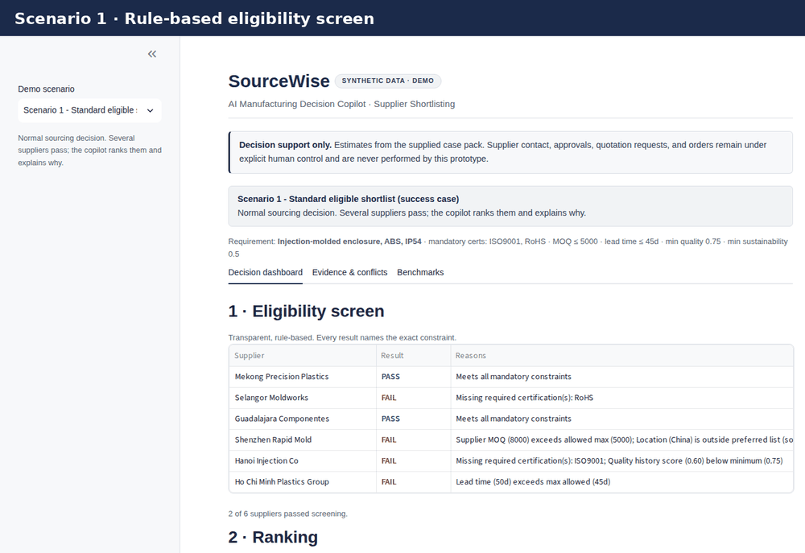
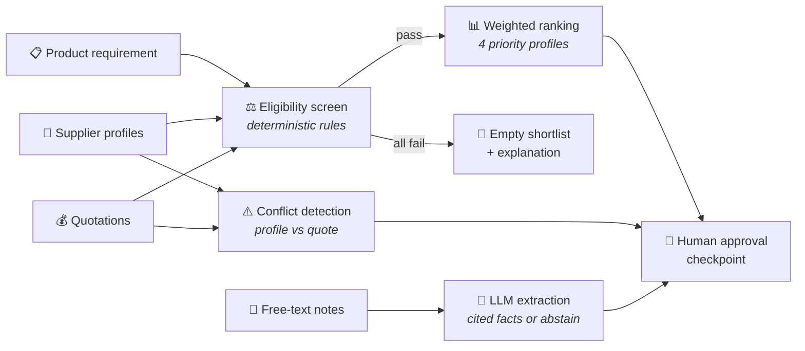
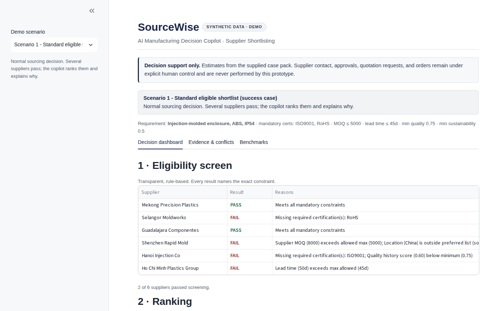
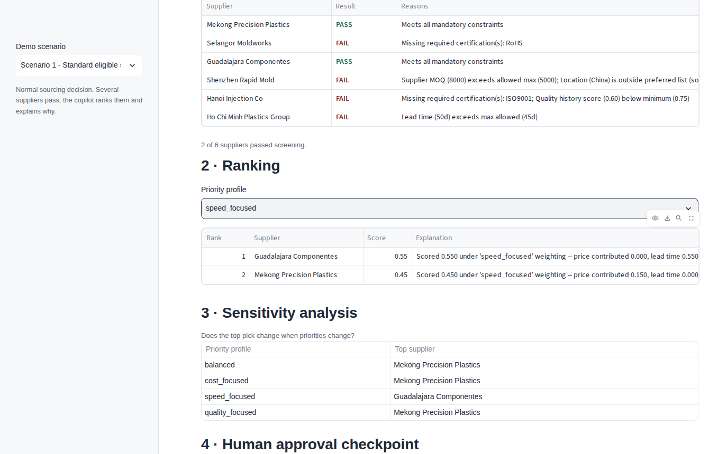
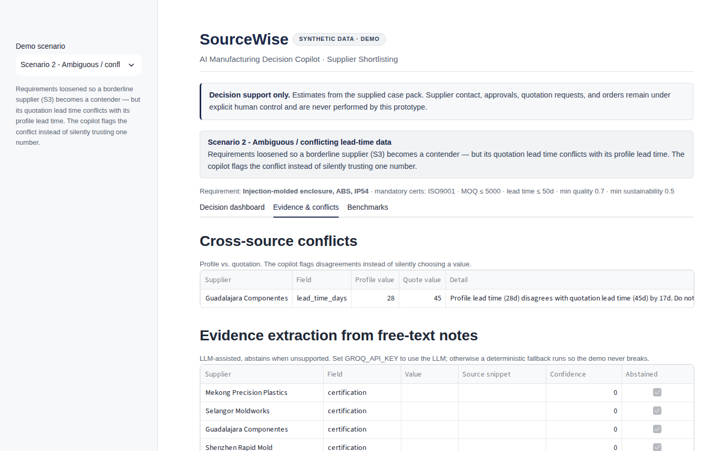
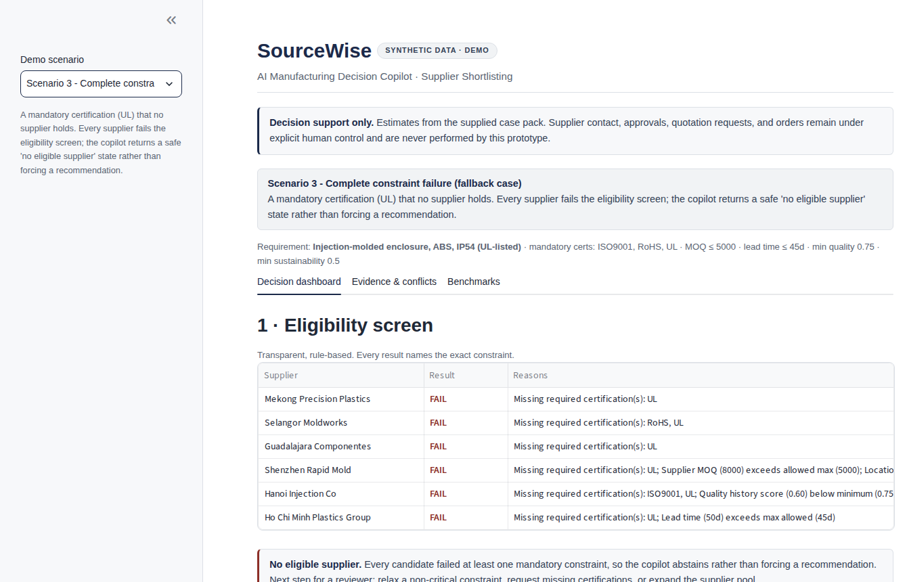
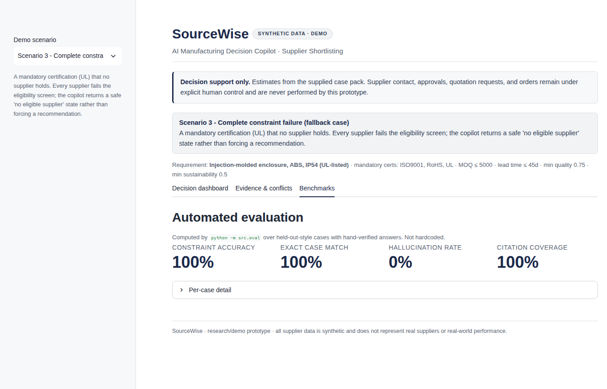

# 🏭 SourceWise

**An AI copilot for supplier shortlisting.** Built for the **Sofstica AI Hackathon 2026** (Manufacturing Decision Copilot theme, Track 1).


<p align="center">
  
</p>

You give it a product requirement, a set of supplier profiles, and their
quotations. It screens the suppliers against the mandatory constraints, ranks the
ones that pass, pulls supporting evidence out of the free-text notes, flags places
where two sources disagree, and leaves the final call to a person. It doesn't
contact anyone or place orders.

All the data in here is synthetic. The organizers didn't ship a case pack, so we
generated our own to match the field shapes in the brief. It's here to show the
method works, not to say anything about real suppliers.

## 💡 The idea

Most of a shortlisting decision is just rules: does the supplier hold the required
certifications, is their minimum order quantity under our cap, is the lead time
acceptable. That part runs in plain Python. It's deterministic, easy to check, and
can't make things up.

The one thing rules handle badly is the free-text note attached to each supplier,
things like "RoHS lapsed, renewal filed" or "quoted lead time assumes no tooling
changes." That's the only place the LLM is used. It extracts cited facts and
abstains when the text doesn't actually support an answer. So the AI is doing
something the rest of the code can't, rather than being added for the sake of it,
and if the API is unavailable the shortlist still runs on the fallback.



| Layer | How it works | Why |
|-------|--------------|-----|
| Eligibility screen | Plain Python rules | Deterministic, auditable, can't hallucinate |
| Ranking | Transparent weighted score, 4 priority profiles | Explainable, with sensitivity analysis built in |
| Conflict detection | Compares supplier profiles against quotations | Surfaces disagreements instead of silently picking one |
| Note extraction | LLM (Groq) with a keyword fallback | The only task rules can't do; abstains when unsupported |
| Final decision | Human approval checkpoint | The copilot recommends; a person decides |

## 🎬 The three demo scenarios

The sidebar switches between three cases, so the demo covers the easy path and the
awkward ones.

### 1. Standard shortlist
Several suppliers pass and get ranked. Change the priority profile and the top pick
shifts, which is the sensitivity analysis.

<p align="center">
  
  
</p>

### 2. Conflicting data
One supplier's profile says a 28-day lead time while its quote says 45. The app
flags the disagreement instead of quietly picking one.

<p align="center">
  
</p>

### 3. No eligible supplier
A certification nobody holds. It returns an empty shortlist and explains why, rather
than forcing a recommendation.

<p align="center">
  
</p>

## 🚀 Running it

```
python -m venv venv
venv\Scripts\activate            # Windows PowerShell
pip install -r requirements.txt
streamlit run app/streamlit_app.py
```

It runs without an API key. The note extraction falls back to a keyword matcher so
the app never breaks offline. To use the real model, copy `.env.example` to `.env`
and add a free Groq key from https://console.groq.com/keys:

```
GROQ_API_KEY=gsk_...
```

Default model is `openai/gpt-oss-20b`. Groq deprecated `llama-3.1-8b-instant` in
June 2026, so don't use that one. You can point at a different model with
`GROQ_MODEL` in the .env.

## 🧪 Tests and evaluation

```
python -m pytest tests/ -q       # 9 tests
python -m src.eval               # prints the benchmark
python -m src.manifest           # regenerates SHA-256 checksums for the data files
```

`src/eval.py` runs the eligibility logic over a small set of hand-checked cases and
reports constraint accuracy, citation coverage, and a hallucination rate. The
hallucination rate is measured against a field that's deliberately absent from
every note, so a correct system abstains on it every time. Those numbers are
computed by the script, not written in by hand.

| Metric | Result |
|--------|--------|
| Constraint accuracy | **100%** |
| Exact case match | **100%** |
| Citation coverage | **100%** |
| Hallucination rate | **0%** |

<p align="center">
  
</p>

## 📁 Project layout

```
src/
  schema.py        pydantic models the rest of the code builds on
  rules.py         eligibility screen, deterministic
  rank.py          weighted ranking with four priority profiles
  conflicts.py     flags profile-vs-quotation disagreements
  extract_llm.py   Groq extraction with a no-API fallback
  evaluate.py      metric helpers used inside the app
  eval.py          standalone benchmark
  manifest.py      checksum manifest generator
app/streamlit_app.py
assets/            demo GIF and screenshots used in this README
data/synthetic/    requirements, suppliers, quotations, scenarios, eval cases
docs/              method card, evaluation report, safety statement, pitch
tests/
```

## 🔒 Data and safety

The data is synthetic and labelled as such in the app and the manifest. The only
thing that ever leaves the machine is the Groq request for note extraction, and only
if you've set a key. Extracted facts are always shown with their source snippet and a
confidence score, never presented as verified truth. The key lives in `.env`, which
is gitignored. Full details in `docs/SAFETY_AND_DATA_STATEMENT.md`.

## ⚠️ Known limitations

It's a small synthetic sample, so the metrics show that the pipeline behaves
correctly, not that it predicts real supplier performance. The ranking is a
transparent weighted score rather than a trained model, which is why the sensitivity
view sits right next to it. If a real case pack shows up later, the plan is a single
ingest module that maps it into the schemas in `src/schema.py`; nothing downstream
would have to change.

More detail is in `docs/`: the method card, evaluation report, intended use and
limitations, and the pitch outline.

## 👤 Author

**Muhammad Mujtaba Khan Suri** — CS @ UBIT, University of Karachi
[GitHub](https://github.com/MMujtabaX)
